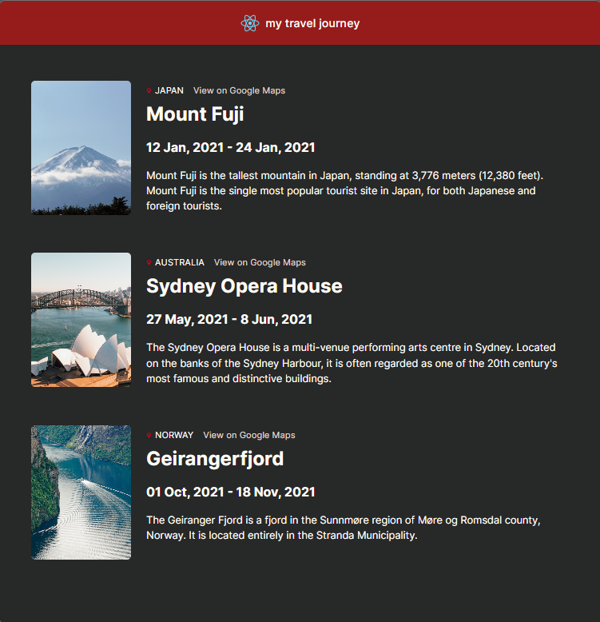

# 🌍 Travel Blog Application

A simple and responsive **Travel Blog** web application built with **React**, where users can explore travel stories and destinations through a clean and modern UI. This project focuses on component-based architecture, reusable UI elements, and client-side rendering using React.

---

## ✨ Features

- 🧭 Browse travel blog posts
- 🖼️ Image-based blog cards
- 📱 Fully responsive design
- ⚛️ Built with reusable React components
- 🎨 Clean and minimal UI

---

## 🛠️ Tech Stack

- **Frontend**
  - React
  - JavaScript (ES6+)
  - HTML5
  - CSS3

- **Tooling**
  - Create React App
  - npm

---

## 📸 Screenshots

### Travel Blog


---

## ⚙️ Getting Started

Follow the steps below to run the project locally.

### 1️⃣ Clone the repository

```bash
git clone https://github.com/TasinTausif/TravelBlog.git
cd TravelBlog
```

### 2️⃣ Install dependencies

```bash
npm install
```

### 3️⃣ Run the development server

```bash
npm start
```

The app will be available at:

👉 http://localhost:3000

---

## 🏗️ Build for Production

To create a production-ready build:

```bash
npm run build
```

This will generate an optimized build in the `build/` directory.

---

## 🧠 Concepts Practiced

- React component structure
- Props and state management
- JSX rendering
- Responsive UI design
- Project structuring in React

⭐ If you like this project, don’t forget to give it a star!

